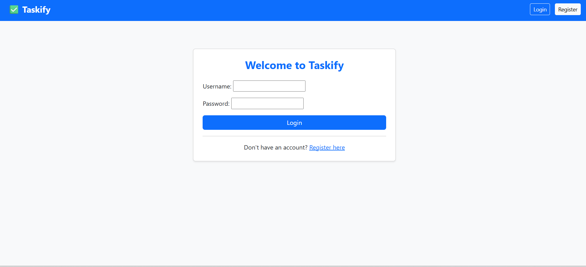
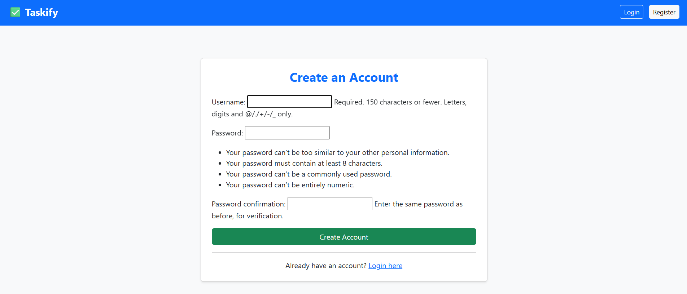
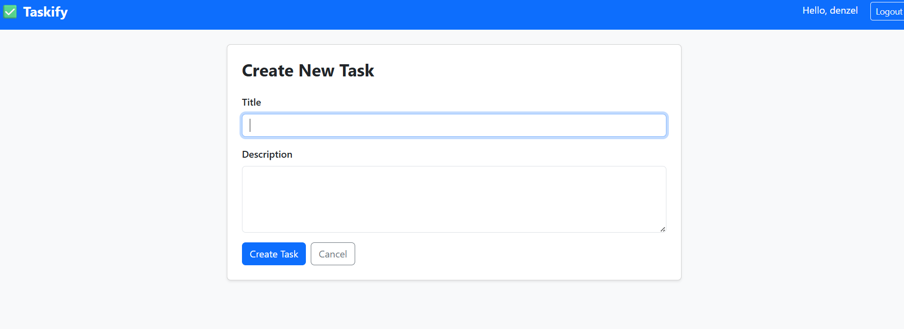

# Taskify - Task Management Application

A full-stack task management web application built with Django and Django REST Framework, featuring user authentication, a REST API with token authentication, and live deployment.

## Live Demo
🌐 [https://taskify.onrender.com](https://taskify.onrender.com)

## Features
- User registration and authentication
- Create, read, update and delete tasks (CRUD)
- Set priority levels (Low, Medium, High)
- Set due dates on tasks
- Search and filter tasks
- REST API with token authentication
- API pagination
- Responsive UI with Bootstrap 5
- PostgreSQL database in production

## Tech Stack
| Technology | Purpose |
|---|---|
| Python & Django | Backend framework |
| Django REST Framework | REST API |
| PostgreSQL | Production database |
| Bootstrap 5 | Frontend styling |
| Gunicorn | Production web server |
| Render | Cloud deployment |
| WhiteNoise | Static file serving |

## API Endpoints
| Method | Endpoint | Description | Auth Required |
|---|---|---|---|
| POST | `/api/token/` | Get authentication token | No |
| GET | `/api/tasks/` | List all your tasks | Yes |
| POST | `/api/tasks/create/` | Create a new task | Yes |
| PUT | `/api/tasks/<id>/update/` | Update a task | Yes |
| DELETE | `/api/tasks/<id>/delete/` | Delete a task | Yes |

## How to Use the API
**Step 1 - Get your token:**
```bash
POST /api/token/
Content-Type: application/json

{
    "username": "yourusername",
    "password": "yourpassword"
}
```

**Step 2 - Use your token:**
```bash
GET /api/tasks/
Authorization: Token your-token-here
```

## Getting Started Locally

**1. Clone the repository**
```bash
git clone https://github.com/denzel-builds/bank-learning.git
cd bank-learning
```

**2. Create and activate virtual environment**
```bash
python -m venv venv
venv\Scripts\activate  # Windows
```

**3. Install dependencies**
```bash
pip install -r requirements.txt
```

**4. Create a .env file**
```bash
SECRET_KEY=your-secret-key
DATABASE_URL=sqlite:///db.sqlite3
DEBUG=True
```

**5. Run migrations**
```bash
python config/manage.py migrate
```

**6. Start the server**
```bash
python config/manage.py runserver
```

**7. Visit** `http://127.0.0.1:8000`

## Author
**Tadiwa Denzel Muleya**
- LinkedIn: https://www.linkedin.com/in/tadiwa-denzel-muleya/
- GitHub: https://github.com/denzel-builds

## Screenshots



.png)

.png)
